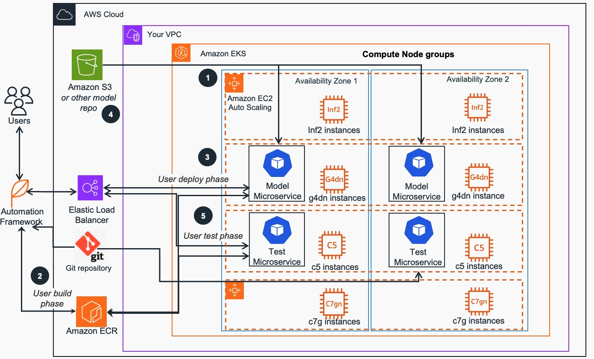

# Machine Learing Inference workload deployment sample with optional bin-packing
The **guidance-for-machine-learning-inference-on-aws repository** contains an end-to-end example for running model inference locally on Docker or at scale on Amazon EKS Kubernetes cluster. 
It supports EKS compute nodes based on CPU, GPU, Graviton and Inferentia processor architecture  and can pack multiple models in a single processor core for improved cost efficiency.
While this example focuses on one processor target at a time, iterating over the steps below for CPU/GPU and Inferentia 
enables hybrid deployments where the best processor/accelerator is used to serve each model depending on its resource consumption profile.
In this sample repository, we use a [bert-base](https://huggingface.co/distilbert-base-multilingual-cased) NLP model from [huggingface.co](https://huggingface.co/), however the project structure and workflow is generic and can be adapted for use with other models.

<div align="center">
  
<br/>
Fig. 1 - Sample Amazon EKS cluster infrastructure for deploying, running and testing ML Inference workloads
</div>
<br/>

The ML inference workloads in this sample project are deployed on the CPU, GPU, or Inferentia nodes as shown on Fig. 1. The control scripts run in any location that has access to the cluster API. To eliminate latency concern related to the cluster ingress, load tests run in a pod within the cluster and send requests to the models directly through the cluster pod network.
<div align="left">
1. The Amazon EKS cluster has several node groups, with one EC2 instance family per node group. Each node group can support different instance types, such as CPU (c5,c6i,c7g), GPU (g4dn), AWS Inferentia (Inf2)
and can pack multiple models per EKS node to maximize the number of served ML models that are running in a node group. 
Model bin packing is used to maximize compute and memory utilization of the compute node EC2 instances in the cluster node groups.
<br/>  
2. The natural language processing (NLP) open-source PyTorch model from [huggingface.co](https://huggingface.co/) serving application and ML framework dependencies are built by users as container images using Automation framework uploaded to Amazon Elastic Container Registry - [Amazon ECR](https://aws.amazon.com/ecr).
<br/>
3. Using project Automation framework, Model container images are obtained from Amazon ECR and deployed to [Amazon EKS cluster](https://aws.amazon.com/eks/) using generated Deployment and Service manifests via calls to Kubernetes API exposed via [Elastic Load Balancer](https://aws.amazon.com/elasticloadbalancing/) (ELB). Model deployments are customized for each target EKS compute node  processor architecture via settings in the central configuration file.
<br/>
4. Following best practices of separation of Model data from containers that run it, ML model microservice design allows to scale out to a large number of models. In this project, model containers are pulling model data from
Amazon Simple Storage Service ([Amazon S3](https://aws.amazon.com)) and other public model data sources each time they are initialized. 
<br/>
5. Using project Automation framework, Test container images are obtained from ECR registry and deployed to EKS cluster using generated Deployment and Service manifests via Kubernetes API. 
Test deployments are customized for each deployment target EKS compute node processor architecture via settings in the central configuration file. Load/scale testing is performed via sending simultaneous requests
to the Model service pool. Performance Test results metrics are obtained, recorded and aggregated.
<br/>
</div>
<br/><br/>
<div align="center">
<a href="https://www.youtube.com/watch?v=g9XRhGhQhAE"></a>
</br>
Fig. 2 - ML Inference video walkthrough
</div>
<br/>

Please watch this end-to-end accelerated [video walkthrough](https://bit.ly/aws-do-inference-video) (7 min) or follow the instructions below to build and run your own inference solution.

## Prerequisites
This sample can be run on a single machine using Docker, or at scale on a Amazon EKS cluster.

It is assumed that the following basic tools are present: [docker](https://docs.docker.com/get-docker/), [kubectl](https://kubernetes.io/docs/tasks/tools/), [envsubst](https://command-not-found.com/envsubst), [kubetail](https://github.com/johanhaleby/kubetail), [bc](https://howtoinstall.co/en/bc).

## Operation

The project is operated through a set of action scripts as described below. To complete a full cycle from beginning-to-end, first configure the project, then follow steps 1 through 5 executing the corresponding action scripts. Each of the action scripts has a help screen, which can be invoked by passing "help" as argument: `<script>.sh help` 

### Optional - Provision an EKS cluster with 3 node groups
To provision this "opinionated" EKS cluster infrastructure optimized for running this guidance, run the `./provision.sh` script.
Optionally, you can use an existing EKS cluster you have or provision a new one using one of [Terraform EKS blueprint](https://aws-ia.github.io/terraform-aws-eks-blueprints/) that would contains nodegroups of desired target instance types.
```
./provision.sh
```
This command will execute a script that creates a CloudFormation stack which deploys an EC2 "management" instance in your default AWS region. That instance contains a *userData* script that provisions an EKS cluster in the **us-west-2** region, pre-defined per specification based on the following [template](https://github.com/aws-samples/aws-do-eks/blob/main/wd/conf/eksctl/yaml/eks-inference-workshop.yaml-template) which is a part of another Git repo project. 
After that EKS cluster is provisoned, it is fully acessible from that EC2 "management" instance and this repository is copied there as well, ready to proceed to next steps.

### Configure
```
./config.sh
```
A centralized configuration file `config.properties` contains all settings that are customizeable for the project.
This file comes pre-configured with reasonable defaults that work out of the box. To set the `processor` target or 
any other setting edit the config file, or execute the `config.sh` script. 
Configuration changes take effect immediately upon execution of the next action script.

### 1. Build
```
./build.sh
```
This step builds a base container for the selected processor. 
A base container is required for any of the subsequent steps. 
This step can be executed on any instance type, regardless of processor target. 

Optionally, if you'd like to push the base image to a container registry, execute `./build.sh push`.
Pushing the base image to a container registry is required if you are planning to run the test step against models deployed to Kubernetes. 
If you are using a private registry and you need to login before pushing, execute `./login.sh`. This script will login to AWS ECR, 
other private registry implementations can be added to the script as needed.

### 2. Trace
```
./trace.sh
```
Compiles the model into a TorchScript serialized graph file (`.pt`). This step requires the model to run on the target processor.
Therefore it is necessary to run this step on an instance that has the target processor available. 

Upon successful compilation, the model will be saved in a local folder named `trace-{model_name}`.

#### Note
It is recommended to use the [AWS Deep Learning AMI](https://docs.aws.amazon.com/dlami/latest/devguide/what-is-dlami.html) to launch the instance where your model will be traced.

* To trace a model for GPU, run the trace step on a [GPU instance](https://aws.amazon.com/ec2/instance-types/#Accelerated_Computing) launched with the [AWS DLAMI](https://docs.aws.amazon.com/dlami/latest/devguide/launch.html).

* To trace a model for Inferentia, run the trace step on an [Inferentia instance](https://aws.amazon.com/ec2/instance-types/#Accelerated_Computing) launched with the [AWS DLAMI with Neuron](https://docs.aws.amazon.com/dlami/latest/devguide/tutorial-inferentia-launching.html) and activate the [Neuron compiler conda environment](https://docs.aws.amazon.com/dlami/latest/devguide/tutorial-inferentia-pytorch-neuron.html)


### 3. Pack
```
./pack.sh
````
Packs the model in a container with FastAPI, also allowing for multiple models to be packed within the same container.
FastAPI is used as an example here for simplicity and performance, however it can be interchanged with any other model server. 
For the purpose of this project we pack several instances of the same model in the container, however a natural extension
of the same concept is to pack different models in the same container.

To push the model container image to a registry, execute `./pack.sh push`. 
The model container must be pushed to a registry if you are deploying your models to Kubernetes.

### 4. Deploy
```
./deploy.sh
```
This script runs your models on the configured runtime. The project has built-in support for both
local Docker runtimes and Kubernetes. The deploy script also has several sub-commands that facilitate
the management of the full lifecycle of your model server containers.
* `./deploy.sh run` - (default) runs model server containers
* `./deploy.sh status [number]` - show container / pod / service status. Optionally show only specified instance number
* `./deploy.sh logs [number]` - tail container logs. Optionally tail only specified instance number
* `./deploy.sh exec <number>` - open bash into model server container with the specified instance number
* `./deploy.sh stop` - stop and remove deployed model contaiers from runtime

### 5. Test
```
./test.sh
```
The test script helps run a number of tests against the model servers deployed in your runtime environment.
* `./test.sh build` - build test container image
* `./test.sh push` - push test image to container registry
* `./test.sh pull` - pull the current test image from the container registry if one exists
* `./test.sh run` - run a test client container instance for advanced testing and exploration
* `./test.sh exec` - open shell in test container
* `./test.sh status`- show status of test container
* `./test.sh stop` - stop test container
* `./test.sh help` - list the available test commands
* `./test.sh run seq` - run sequential test. One request at a time submitted to each model server and model in sequential order.
* `./test.sh run rnd` - run random test. One request at a time submitted to a randomly selected server and model at a preset frequency.
* `./test.sh run bmk` - run benchmark test client to measure throughput and latency under load with random requests
* `./test.sh run bma` - run benchmark analysis - aggregate and average stats from logs of all completed benchmark containers

## Clean up

You can uninstall the sample code for this Guidance using the AWS Command Line Interface. You must also delete the EKS cluster if it was deployed using references from this Guidance, since removal of the scale testing framework does not automatically delete Cluster and its resources.

To stop or uninstall scale Inferencetest job(s), run the following command:
```shell
./test.sh stop
```
It should delete all scale test pods and jobs from the specified EKS K8s namespace.

To stop or uninstall Inference model services, run the following command:
```shell
./deploy.sh stop
```
It should delete all Model deployments, pods, and services from the specified EKS K8s namespace.

If you provisioned an EKS cluster when setting up your prerequisites for the project  as described in the "Optional - Provision an EKS cluster with 3 node groups" above, you can clean up the cluster and all resources associated with it by running this script:
```
./remove.sh
```
It should delete EKS cluster compute node groups first, then IAM service account used in that cluster, then cluster itself and, finally, ManagementInstance EC2 instance via corresponding Cloud Formations. Sometimes you may need to run that command a few times as individual stack deletion commands may time out - that should not create any problem.

## Security

See [CONTRIBUTING](CONTRIBUTING.md#security-issue-notifications) for more information.

## License

This library is licensed under the MIT-0 License. See the LICENSE file.

## References

* [Huggingface](https://huggingface.co)
* [EKS](https://aws.amazon.com/eks)
* [aws-do-eks](https://github.com/aws-samples/aws-do-eks)
* [FastAPI](https://fastapi.tiangolo.com/)
* [AWS GPU](https://aws.amazon.com/nvidia/#_AWS_and_NVIDIA_Services)
* [AWS Inferentia](https://aws.amazon.com/machine-learning/inferentia/)
* [Instance Selector](https://instances.vantage.sh/?selected=inf1.6xlarge)
* [kubetail](https://github.com/johanhaleby/kubetail)
* [envsubst](https://www.gnu.org/software/gettext/manual/gettext.html#envsubst-Invocation)
* [AWS Machine Learning blog post](https://aws.amazon.com/blogs/machine-learning/serve-3000-deep-learning-models-on-amazon-eks-with-aws-inferentia-for-under-50-an-hour/)
* [Guidance for Low Latency, High Throughput Inference on Amazon EKS](https://bit.ly/aws-inference-guidance)

